illustration: abstract yin-yang style fish in gold and purple

# Optimizing Long-Term Lipid Control With Statin Combination Therapy

## Tonvasca ® 同抑脂

2026.09.02

童綜合醫院 新陳代謝科

曾耀賢 醫師

# 大綱

icon: number 1

## 台灣年長族群的三高與多重用藥現況與挑戰

icon: number 2

## 血脂異常管理的需求與指引建議

* Statin 單方治療的限制與第一線組合治療的角色

icon: number 3

## Pitavastatin/Ezetimibe FDC 第三期臨床試驗

icon: number 4

## 最適合亞洲人的 statin

* Pitavastatin 的代謝途徑特性與藥物交互作用風險

icon: number 5

## 重點回顧與摘要

* FDC 在血脂異常管理中的價值

TRO-2026-001

2

# 您手上有多少三高共病患者？

3

# 國建署最新統計顯示，三高已成常態

## 國民營養健康調查：2018–2022 三高盛行率

### 20 歲以上人口

<table>
  <thead>
    <tr>
        <th>項目</th>
        <th>盛行率 (%)</th>
    </tr>
  </thead>
  <tbody>
    <tr>
        <td>高血壓</td>
        <td>27.9</td>
    </tr>
    <tr>
        <td>高血糖</td>
        <td>11.5</td>
    </tr>
    <tr>
        <td>高血脂</td>
        <td>28.0</td>
    </tr>
  </tbody>
</table>

高血壓

### 65 歲以上人口

<table>
  <thead>
    <tr>
        <th>項目</th>
        <th>盛行率 (%)</th>
    </tr>
  </thead>
  <tbody>
    <tr>
        <td>高血壓</td>
        <td>63.0</td>
    </tr>
    <tr>
        <td>高血糖</td>
        <td>28.2</td>
    </tr>
    <tr>
        <td>高血脂</td>
        <td>40.0</td>
    </tr>
  </tbody>
</table>

高血壓

4

111 年健康促進統計年報
TRO-2026-001

# 台灣高齡族群的多重用藥現況

## Polypharmacy

is defined as

icon: five pill capsules in different colors

Regular use of
**≥5 medications1**

## Prevalence among people ≥65 years old in Taiwan2

<table>
  <thead>
    <tr>
        <th>Polypharmacy (5–9 drugs)</th>
        <th>Hyper-polypharmacy (≥10 drugs)</th>
        <th>Potentially inappropriate medications</th>
    </tr>
  </thead>
  <tbody>
    <tr>
        <td>35.4%</td>
        <td>14.5%</td>
        <td>66.5%</td>
    </tr>
  </tbody>
</table>

1. Halli-Tierney AD, et al. Am Fam Physician. 2019;100(1):32-38. 2. Meng LC, et al. Arch Gerontol Geriatr. 2023;115:105100.

5

TRO-2026-001

# 多重用藥引發多重問題

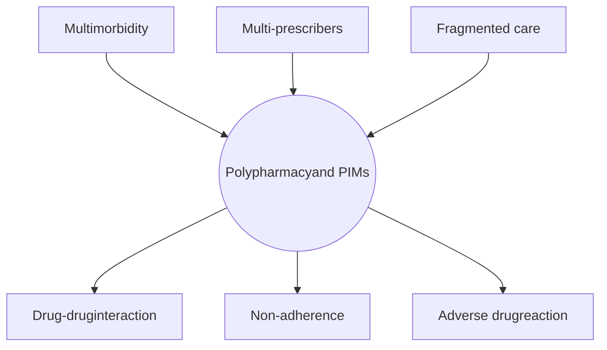

Risk of adverse drug events among patients taking multiple drugs3

<table>
  <thead>
    <tr>
        <th>Number of drugs</th>
        <th>Risk (%)</th>
    </tr>
  </thead>
  <tbody>
    <tr>
        <td>2 drugs</td>
        <td>13</td>
    </tr>
    <tr>
        <td>5 drugs</td>
        <td>38</td>
    </tr>
    <tr>
        <td>≥7 drugs</td>
        <td>82</td>
    </tr>
  </tbody>
</table>

**Adverse outcome of polypharmacy1,2**

PIMs, potentially inappropriate medications.
1. Davies LE, et al. J Am Med Dir Assoc. 2020;21(2):181-187. 2. Borodo SB, et al. Bull Natl Res Cent. 2022;46:178. 3. Goldberg RM, et al. Am J Emerg Med. 1996;14(5):447-450.

TRO-2026-001

6

# 三高治療藥物易在多重途徑產生藥物交互作用

## Mechanisms of drug-drug interactions1-6

### Renal excretion

**Anti-HTN**
* β blockers
* ACEI/ARB

**Anti-DM**
* Metformin
* Sulfonylurea
* DPP-4 inhibitor (e.g., sitagliptin)

* Urinary or Biliary excretion

* Altered transport proteins

### Substrate of P-gp or BCRP

**Statins**
* Lovastatin
* Pravastatin
* Atorvastatin
* Fluvastatin
* Rosuvastatin
* Pitavastatin

**Anti-HTN**
* α blocker (e.g., doxazosin)
* β blocker (e.g., nadolol)
* CCB (e.g., verapamil)

**Anti-DM**
* Sulfonylurea
* DPP-4 inhibitor (e.g., saxagliptin)

diagram: puzzle pieces showing Absorption, Excretion, Distribution, and Metabolism

* Binding to plasma protein

* Altered transport proteins

### Substrate of CYP enzymes

**Statins**
* Simvastatin
* Atorvastatin
* Fluvastatin

**Anti-HTN**
* ARBs (e.g., losartan, irbesartan)
* CCBs
* β blockers

**Anti-DM**
* Sulfonylurea
* TZDs
* DPP-4 inhibitor (e.g., saxagliptin)

* Inhibition of CYP enzymes

* induction of CYP enzymes

ACEI, angiotensin converting enzyme inhibitor; ARB, angiotensin receptor blocker; CCB, calcium channel blocker; CYP, cytochrome P450; DM, diabetes meelitus; DPP-4, dipeptidyl peptidase 4; HTN, hypertension; TZD, thiazolidinedione.
1. Rai GS, Rozario CJ. Anaesth Intensive Care Med. 2023;24:4. 2. Huang W, et al. Front Pharmacol. 2025;16:1618701. 3. Kellick KA, et al. J Clin Lipidol. 2014;8(3 Suppl):S30-S46. 4. Fravel MA, Ernst M. Curr Hypertens Rep. 2021;23(3):14. 5. May M, Schindler C. Ther Adv Endocrinol Metab. 2016;7(2):69-83. 6. Zanchi A, et al. Swiss Med Wkly. 2012;142:w13629. 7. Sica DA. J Clin Hypertens (Greenwich). 2004;6(10 Suppl 2):24-30.

TRO-2026-001

7

# 三高用藥常見藥物交互作用組合 (1)

## Combination: Statin + CCBs1-3

<table>
  <thead>
    <tr>
        <th>Mechanism</th>
        <th>CYP3A4 inhibitors</th>
        <th>CYP3A4 substrates</th>
        <th>Clinical risk</th>
    </tr>
  </thead>
  <tbody>
    <tr>
        <td>Inhibition of CYP3A4 by CCBs might increase statin blood concentration flow_chart: CCB inhibiting CYP3A4 metabolism of Statin</td>
        <td>* Verapamil * Diltiazem * Amlodipine * Nifedipine</td>
        <td>* Simvastatin * Atorvastatin * Fluvastatin</td>
        <td>Elevated risk of muscle-related side effects and (in rare cases) rhabdomyolysis.</td>
    </tr>
  </tbody>
</table>

## Combination: Statin + Anti-coagulant (Warfarin)1,4

<table>
  <thead>
    <tr>
        <th>Mechanism</th>
        <th>Clinical risk</th>
    </tr>
  </thead>
  <tbody>
    <tr>
        <td>Warfarin and some of statins (e.g., rosuvastatin, fluvastatin) are both metabolized by CYP2C9 flow_chart: Statin and Warfarin competition for CYP2C9</td>
        <td>Co-initiation of statin and warfarin is suggested to increase the INR, and potentially elevate the risk of bleeding icon: finger prick blood drop</td>
    </tr>
  </tbody>
</table>

CCBs, calcium channel blockers; CYP cytochrome P450; INR, international normalized ratio.

1. Kellick KA, et al. J Clin Lipidol. 2014;8(3 Suppl):S30-S46. 2. Fravel MA, Ernst M. Curr Hypertens Rep. 2021;23(3):14. 3. Ehelepola NDB, et al. Case Rep Med. 2017;2017:8383251. 4. Engell AE, et al. Br J Clin Pharmacol. 2021;87(2):694-699.

TRO-2026-001

8

# 三高用藥常見藥物交互作用組合 (2)

## Combination: ACEI/ARB + diuretics + NSAIDs1

**Mechanism**

* ACEi/ARB (RAS inh.) can cause decrease in GFR.

* Diuretics may lead to hypovolemia.

* NSAIDs can constrict the blood flow into the glomerulus via the afferent arteriole and reduce GFR.

icon: kidney illustration

**Clinical risk**

An increased risk of developing pre-renal acute kidney injury (pr-AKI)

## Combination: Anti-diabetics + β blockers2

**Mechanism**

* β blockers blunt the warning symptoms of hypoglycemia (e.g., tachycardia, tremors)

* β blockers can also suppress glycogenolysis, preventing correction of hypoglycemia

**Clinical risk**

Masking of hypoglycemic events, potentially leading to unrecognized severe hypoglycemia

icon: warning drop with arrows

ACEI, angiotensin converting enzyme inhibitor; ARB, angiotensin receptor blocker; GFR, glomerular filtration rate; NSAIDs, non-steroidal anti-inflammatory drugs; RAS, renin angiotensin system.
1. Harężlak T, et al. Adv Ther. 2022;39(1):140-147. 2. Casiglia E, Tikhonoff V. Hypertension. 2017;70(1):42-43.

TRO-2026-001

9

# 指引導向藥物治療是否足以應對血脂異常管理中，未被滿足的需求？

*Does guideline directed therapy fulfill the unmet needs of dyslipidemia management?*

10

# Statin 類藥物降脂強度總覽

icon: ≥50% LDL-C reduction indicator

## High-intensity
## ↓ ≥50% LDL-Ca

* Atorvastatin 40–80 mg/day

* Rosuvastatin 20–40 mg/day

icon: 30-49% LDL-C reduction indicator

## Moderate-intensity
## ↓ 30-49% LDL-Ca

* Atorvastatin 10–20 mg/day

* Rosuvastatin 5–10 mg/day

* Simvastatin 20–40 mg/day

* Pravastatin 40–80 mg/day

* Lovastatin 40 mg/day

* Fluvastatin XL 80 mg/day

* Fluvastatin 40 mg BID

* Pitavastatin 2–4 mg/day

icon: <30% LDL-C reduction indicator

## Low-intensity
## ↓ <30% LDL-Ca

* Simvastatin 10 mg/day

* Pravastatin 10–20 mg/day

* Lovastatin 20 mg/day

* Fluvastatin 20–40 mg/day

* Pitavastatin 1 mg/day

LDL-C, low-density lipoprotein cholesterol; XL, extended-release.

1. Grundy SM, et al. Circulation. 2019;139(25):e1046-e1081. 2. Grundy SM, et al. Circulation. 2019;139(25):e1082-e1143.

TRO-2026-001

11

# 即使使用到高劑量 statin，只要無法達到 LDL-C 目標，心血管事件風險仍高

pie_chart: >40% of trial patients assigned to high-dose statin therapy DID NOT reach an LDL-C level <70 mg/dL

### On-Statin LDL-C levels and risk for major cardiovascular events

<table>
  <thead>
    <tr>
        <th>Achieved on-statin LDL-C (mg/dL)</th>
        <th>Risk of major CV events (HR)</th>
        <th>Percent</th>
        <th>Series</th>
    </tr>
  </thead>
  <tbody>
    <tr>
        <td>0</td>
        <td>0.4</td>
        <td>0</td>
        <td>Risk of major cardiovascular events</td>
    </tr>
    <tr>
        <td>50</td>
        <td>0.55</td>
        <td>25</td>
        <td>Risk of major cardiovascular events</td>
    </tr>
    <tr>
        <td>100</td>
        <td>0.7</td>
        <td>15</td>
        <td>Risk of major cardiovascular events</td>
    </tr>
    <tr>
        <td>150</td>
        <td>0.8</td>
        <td>2</td>
        <td>Risk of major cardiovascular events</td>
    </tr>
    <tr>
        <td>200</td>
        <td>0.9</td>
        <td>2</td>
        <td>Risk of major cardiovascular events</td>
    </tr>
    <tr>
        <td>250</td>
        <td>1.0</td>
        <td>2</td>
        <td>Risk of major cardiovascular events</td>
    </tr>
  </tbody>
</table>

\* Risk of CV events remains high if LDL-C target is not achieved

CV, cardiovascular; HR, hazard ratio; LDL-C, low-density lipoprotein cholesterol.
Boekholdt SM, et al. J Am Coll Cardiol. 2014;64(5):485-494.

TRO-2026-001

12

# 諸多研究發現，高血脂病人的 LDL-C 達標率仍不理想

<table>
  <tr>
    <th>
    </th>
    <th>
      Population
    </th>
    <th>
      Failure of reaching LDL-C target
    </th>
  </tr>
  <tr>
    <td>
      CEPHEUS study1
    </td>
    <td>
      Total population (n=34,672)
    </td>
    <td>
      50.6%
    </td>
  </tr>
  <tr>
    <td>
    </td>
    <td>
      Asian subgroup (n=7,478)
    </td>
    <td>
      55.3%
    </td>
  </tr>
  <tr>
    <td>
    </td>
    <td>
      High CV risk patients (n=9,273)
    </td>
    <td>
      45.2% (Target: 100 mg/dL)
    </td>
  </tr>
  <tr>
    <td>
    </td>
    <td>
      Very high CV risk patients (n=14,429)
    </td>
    <td>
      77.2% (Target: 70 mg/dL)
    </td>
  </tr>
  <tr>
    <td>
      DYSIS-II2
    </td>
    <td>
      Stable CHD cohort (n=6,794)
    </td>
    <td>
      70.6% (Target: 70 mg/dL)
    </td>
  </tr>
  <tr>
    <td>
    </td>
    <td>
      ACS cohort (n=3,867)
    </td>
    <td>
      81.1% (Target: 70 mg/dL)
    </td>
  </tr>
  <tr>
    <td>
      T-SPARCLE3
    </td>
    <td>
      ASCVD patients (n=4,099)
    </td>
    <td>
      43%     (Target: 100 mg/dL)
    </td>
  </tr>
</table>

ACS, acute coronary syndrome; ASCVD, atherosclerotic cardiovascular disease; CHD, coronary heart disease; CV, cardiovascular; LDL-C, low-density lipoprotein cholesterol.
1. Chiang CE, et al. J Atheroscler Thromb. 2016;23(5):567-587; 2. Gitt AK, et al. Atherosclerosis. 2017;266:158-166; 3. Yeh YT, et al. PLoS One. 2017;12(10):e0186861.

TRO-2026-001

13

# 因為 statin 不耐受性 (intolerance) 而停用 statin ，會帶來不良的後果

# 10-25%

of statin users in real-world clinical practice suffer from side effects.

Some of them are unable or unwilling to continue statins, thus deemed as **statin intolerance**

* Discontinuation of statin therapy among eligible individuals leads to unfavorable outcome

* Non-statin therapies, including ezetimibe or PCSK9i could be used **as a combination therapy** to statin if lipid goal cannot be achieved or statins are intolerant

PCSK9i, proprotein convertase subtilisin/kexin type 9 inhibitor; SAMEs, statin-associated muscle events.

Chien SC, et al. J Formos Med Assoc. 2019;118(10):1385-1392.

14

TRO-2026-001

# 亞洲族群使用強效 statin 的比例明顯較其他族群低

icon: gear

**FOURIER trial**

icon: person

27,564 individuals with established vascular disease and LDL-C ≥70mg/dL or non-HDL-C ≥100mg/dL

icon: syringe

Evolocumab SC vs placebo

icon: document

## Baseline characteristics for Asian and others

<table>
  <tr>
    <th>
      N (%)
    </th>
    <th>
      Asians (n=2,723)
    </th>
    <th>
      Others (n=24,841)
    </th>
    <th>
      p
    </th>
  </tr>
  <tr>
    <td>
      Statin
    </td>
    <td>
    </td>
    <td>
    </td>
    <td>
      &#x3C;0.001
    </td>
  </tr>
  <tr>
    <td>
      High intensity
    </td>
    <td>
      906 (33.3)
    </td>
    <td>
      18,197 (73.3)
    </td>
    <td>
    </td>
  </tr>
  <tr>
    <td>
      Moderate intensity
    </td>
    <td>
      1,816 (66.7)
    </td>
    <td>
      6,576 (26.5)
    </td>
    <td>
    </td>
  </tr>
  <tr>
    <td>
      Low, unknown or no data
    </td>
    <td>
      1 (0.0)
    </td>
    <td>
      68 (0.3)
    </td>
    <td>
    </td>
  </tr>
  <tr>
    <td>
      Ezetimibe
    </td>
    <td>
      101 (3.7)
    </td>
    <td>
      1,339 (5.4)
    </td>
    <td>
      &#x3C;0.001
    </td>
  </tr>
</table>

HDL-C, high-density lipoprotein cholesterol; LDL-C, low-density lipoprotein cholesterol; SC, subcutaneous.
Keech AC, et al. Circ J. 2021;85(11):2063-2070.

TRO-2026-001

15

# 使用不同類型的降血脂藥物，可以從不同作用機轉發揮加乘效果

* Drugs acting on different LDL-C metabolism points produce synergistic effect1

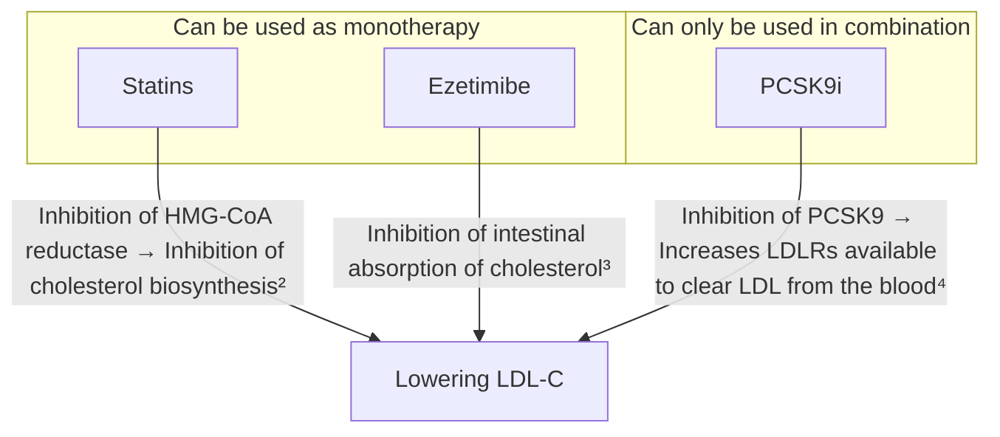

LDL-C, low-density lipoprotein cholesterol; PCSK9i, proprotein convertase subtilisin kexin type 9 inhibitor.

1. Masana L, et al. Curr Cardiol Rep. 2020;22(8):66; 2. Lipitor (Atorvastatin) prescribing information; 3. Vytorin (Simvastatin/ezetimibe) prescribing information; 4. Repatha (Evolocumab) prescribing information.

TRO-2026-001

16

# 綜合分析顯示，低 / 中強度 statin 合併 ezetimibe 治療的<mark>降脂效果優於</mark>高強度 statin 單方治療

icon: gear Meta-analysis of 9 observational studies and 6 RCTs

icon: pill Low/moderate-intensity statin + ezetimibe (n=76,280) vs High-intensity statin monotherapy (n=175,170)

## Significant changes in lipid parameters favoring combination therapy in RCTs

**Low/moderate-intensity statin + ezetimibe**

VS

**High-intensity statin monotherapy**

Risk ratio (95% CI)

Mean difference (95% CI)

<table>
  <tr>
    <th>
    </th>
    <th>
      Risk ratio (95% CI)
    </th>
  </tr>
  <tr>
    <td>
      Achieving LDL-C &#x3C;70 mg/dL
    </td>
    <td>
      1.27 (1.21, 1.34)
    </td>
  </tr>
</table>

1.27 (1.21, 1.34)

<table>
  <tr>
    <th>
    </th>
    <th>
      Mean difference (95% CI)
    </th>
  </tr>
  <tr>
    <td>
      LDL-C
    </td>
    <td>
      -7.95 (-10.02, 5.89)
    </td>
  </tr>
  <tr>
    <td>
      Total cholesterol
    </td>
    <td>
      -26.77 (-27.64, -25.89)
    </td>
  </tr>
  <tr>
    <td>
      Triglyceride
    </td>
    <td>
      -5.69 (-26.25, 14.87)
    </td>
  </tr>
  <tr>
    <td>
      HDL-C
    </td>
    <td>
      +6.42 (-8.37, 21.20)
    </td>
  </tr>
</table>

LDL-C: -7.95 (-10.02, 5.89)
Total cholesterol: -26.77 (-27.64, -25.89)
Triglyceride: -5.69 (-26.25, 14.87)
HDL-C: +6.42 (-8.37, 21.20)

**Combination therapy increased the chance of achieving LDL-C target (<70 mg/dL) by 27%**

**Combination therapy significantly lowered LDL-C and TC**

CI, confidence interval; HDL-C, high-density lipoprotein cholesterol; LDL-C, low-density lipoprotein cholesterol; RCTs, randomized controlled trials; TC, total cholesterol.
Sydhom P, et al. BMC Cardiovasc Disord. 2024;24(1):660.

TRO-2026-001

17

# 綜合分析顯示，低 / 中強度 statin 合併 ezetimibe 治療的臨床效益優於高強度 statin 單方治療

icon: gear

Meta-analysis of 9 observational studies and 6 RCTs

icon: pills

Low/moderate-intensity statin + ezetimibe (n=76,280) vs High-intensity statin monotherapy (n=175,170)

Lower rates of clinical outcomes favoring combination therapy in observational studies

<table>
  <tr>
    <th>
    </th>
    <th>
      Hazard ratio (95% CI)
    </th>
    <th>
    </th>
    <th>
      Interpretation
    </th>
  </tr>
  <tr>
    <td>
      Major adverse cardiovascular event (MACE)*
    </td>
    <td>
    </td>
    <td>
      0.76 (0.73-0.80)
    </td>
    <td>
      Risk of MACE 24%
    </td>
  </tr>
  <tr>
    <td>
      Cardiovascular death
    </td>
    <td>
    </td>
    <td>
      0.80 (0.74-0.88)
    </td>
    <td>
      Risk of cardiovascular death 20%
    </td>
  </tr>
  <tr>
    <td>
      All-cause death
    </td>
    <td>
    </td>
    <td>
      0.84 (0.78-0.91)
    </td>
    <td>
      Risk of all-cause death 16%
    </td>
  </tr>
  <tr>
    <td>
      Non-fatal stroke
    </td>
    <td>
    </td>
    <td>
      0.81 (0.75-0.87)
    </td>
    <td>
      Risk of non-fatal stroke 19%
    </td>
  </tr>
</table>
<table>
  <caption>Scatter Chart: Chart Title</caption>
  <tr>
    <th>
      X-Values
    </th>
    <th>
    </th>
    <th>
    </th>
  </tr>
  <tr>
    <td>
      0.76
    </td>
    <td>
      3.5
    </td>
    <td>
    </td>
  </tr>
  <tr>
    <td>
      0.8
    </td>
    <td>
      2.5
    </td>
    <td>
    </td>
  </tr>
  <tr>
    <td>
      0.81
    </td>
    <td>
      0.5
    </td>
    <td>
    </td>
  </tr>
  <tr>
    <td>
      0.84
    </td>
    <td>
      1.5
    </td>
    <td>
    </td>
  </tr>
  <tr>
    <td>
      1
    </td>
    <td>
    </td>
    <td>
      3.5
    </td>
  </tr>
  <tr>
    <td>
      undefined
    </td>
    <td>
      0
    </td>
    <td>
    </td>
  </tr>
</table>

Favor low/moderate-intensity statin + ezetimibe

Favor High-intensity statin monotherapy

\*Cardiovascular death or major cardiovascular events (myocardial infarction, heart failure, coronary artery revascularization, or non-fatal stroke)

CI, confidence interval; LDL-C, low-density lipoprotein cholesterol; RCTs, randomized controlled trials.

Sydhom P, et al. BMC Cardiovasc Disord. 2024;24(1):660.

TRO-2026-001

18

# 比起高強度 statin 單方治療，
# 低 / 中強度 statin 合併 ezetimibe 治療提供更高的安全性

icon: gear

Meta-analysis of 9 observational studies and 6 RCTs

icon: pills

Low/moderate-intensity statin + ezetimibe (n=76,280) vs High-intensity statin monotherapy (n=175,170)

### Lower risks of AEs with low/moderate-intensity statin + ezetimibe in RCTs

### Less NODM with low/moderate-intensity statin + ezetimibe in observational studies

icon: muscle with lightning bolts

↓48%

Muscle-related AE

RR 0.52; 95%CI 0.32, 0.85

icon: liver with test tube

↓49%

Liver enzyme elevation

RR 0.51; 95%CI 0.20, 0.89

icon: glucose monitor

↓20%

New-onset diabetes

RR 0.80; 95%CI 0.74, 0.87

> RCTs demonstrate superior lipid lowering and fewer adverse effects with low/moderate statins + ezetimibe versus high-dose statin alone, while observational data indicate better clinical outcomes

AE, adverse event; CI, confidence interval; NODM, new-onset diabetes mellitus; RCTs, randomized controlled trials; RR, risk ratio.
Sydhom P, et al. BMC Cardiovasc Disord. 2024;24(1):660.

TRO-2026-001

19

# 血脂異常管理指引更新：
# 第一線組合治療

Guideline update for the dyslipidemia management - Upfront combination therapy

20

# 2025 台灣血脂管理臨床路徑共識

DOI : 10.6314/JIMT.202412_35(6).04.04)

內科學誌 2024 : 35 : 426-430

# 2025 台灣血脂管理臨床路徑共識

李貽恒 1,2 石崇良 3

中華民國心臟學會 中華民國血脂及動脈硬化學會 台灣介入性心臟血管醫學會
台灣內科學會 台灣腦中風學會 台灣家庭醫學醫學會 中華民國糖尿病學會
中華民國糖尿病衛教學會 台灣腎臟醫學會 衛生福利部中央健康保險署

1 國立成功大學醫學院附設醫院內科部
2 國立成功大學醫學院
3 衛生福利部中央健康保險署

2025 台灣血脂管理臨床路徑共識。李貽恒、石崇良。內科學誌。 2024 ： 35 ： 426-430 。

TRO-2026-001

21

# 2025 台灣血脂管理臨床路徑共識 - 風險分級

表一：風險分級目標對象定義

<table>
    <tr>
        <th>低</th>
        <th>中</th>
        <th>高</th>
        <th>非常高</th>
        <th>極高</th>
    </tr>
    <tr>
        <td> \* 心血管風險因子： (低：一項；中：≥兩項)</td>
        <td> \* 糖尿病 \* 慢性腎臟病</td>
        <td> \* 經臨床檢查確診為動脈硬化心血管疾病，包含：</td>
        <td> \* 冠狀動脈疾病合併下列任一臨床狀況：</td>
    </tr>
    <tr>
        <td> 1) 高血壓</td>
        <td> (進入透析治療前的慢性腎臟病，包括UACR ≥ 30 mg/g or eGFR &#x3C; 60 mL/min/1.73 m2 至少持續3個月)</td>
        <td> 1) 急性冠心症病史</td>
        <td> 1) 一年內曾經歷心肌梗塞</td>
    </tr>
    <tr>
        <td> 2) 年齡 (男≥45歲；女≥55歲)</td>
        <td> \* LDL-C ≥190 mg/dL</td>
        <td> 2) 接受血管再通術 (心導管介入治療或外科冠狀動脈繞道手術)</td>
        <td> 2) ≥兩次心肌梗塞病史</td>
    </tr>
    <tr>
        <td> 3) 早發性冠心病家族史 (男≤55歲；女≤65歲)</td>
        <td> \* 冠狀動脈鈣化分數(CAC) ≥ 400</td>
        <td> 3) 缺血性中風/短暫性腦缺血發作合併動脈硬化相關疾病病史</td>
        <td> 3) 多支冠狀動脈阻塞</td>
    </tr>
    <tr>
        <td> 4) HDL-C (男&#x3C;40 mg/dL;女&#x3C;50 mg/dL)</td>
        <td></td>
        <td> 4) 周邊動脈疾病 (曾接受血管再通術、有肢體缺血相關症狀或截肢)</td>
        <td> 4) 急性冠心症合併糖尿病</td>
    </tr>
    <tr>
        <td> 5) 抽菸</td>
        <td></td>
        <td></td>
        <td> 5) 周邊動脈疾病或頸動脈狹窄</td>
    </tr>
    <tr>
        <td> 6) 代謝性症候群 (符合以下至少三項)</td>
        <td></td>
        <td> \* 經影像檢查確認有顯著斑塊負擔，定義為≥50%直徑狹窄，包含：</td>
        <td> \* 周邊動脈疾病合併有</td>
    </tr>
    <tr>
        <td> - 腹部肥胖 (男≥90cm;女≥80cm)</td>
        <td></td>
        <td> 1) 冠狀動脈血管攝影</td>
        <td> 1) 冠狀動脈疾病或</td>
    </tr>
    <tr>
        <td> - 血壓偏高(≥130/85 mmHg或使用高血壓藥物)</td>
        <td></td>
        <td> 2) 冠狀動脈或周邊血管電腦斷層攝影</td>
        <td> 2) 頸動脈狹窄</td>
    </tr>
    <tr>
        <td> - 空腹血糖偏高(≥100mg/dL或使用糖尿病藥物)</td>
        <td></td>
        <td> 3) 頸動脈或周邊血管超音波</td>
        <td></td>
    </tr>
    <tr>
        <td> - 空腹TG偏高(≥150mg/dL或使用治療TG血脂藥物)</td>
        <td></td>
        <td></td>
        <td></td>
    </tr>
    <tr>
        <td> - HDL-C偏低(男&#x3C;40mg/dL;女&#x3C;50mg/dL)</td>
        <td></td>
        <td></td>
        <td></td>
    </tr>
</table>

eGFR, estimated glomerular filtration rate; HDL-C, high-density lipoprotein cholesterol; LDL-C, low-density lipoprotein cholesterol; TG, triglyceride; UACR, urine albumin-creatinine ratio.

2025 台灣血脂管理臨床路徑共識。李貽恒、石崇良。內科學誌。 2024 ： 35 ： 426-430 。

22

TRO-2026-001

22

# 2025 台灣血脂管理臨床路徑共識 - 初級預防

**Moderate- to high-intensity statin combined with ezetimibe is recommended as an initial treatment strategy for high-risk patients.**

## 血脂管理路徑-初級預防

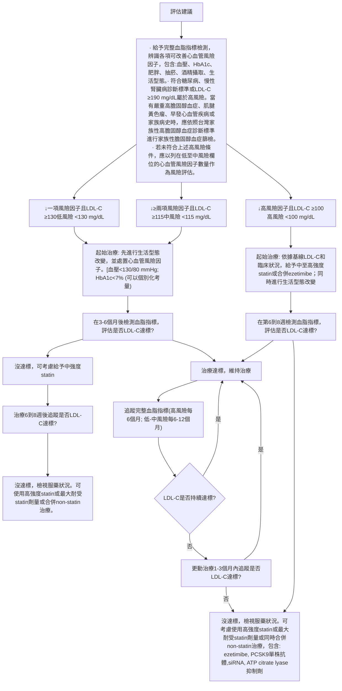

2025 台灣血脂管理臨床路徑共識。李貽恒、石崇良。內科學誌。 2024 ： 35 ： 426-430 。

TRO-2026-001

23

# 2025 台灣血脂管理臨床路徑共識 - 次級預防

**Moderate- to high-intensity statin combined with ezetimibe is recommended as an initial treatment strategy for very high risk and extremely high risk patients.**

## 血脂管理路徑-次級預防

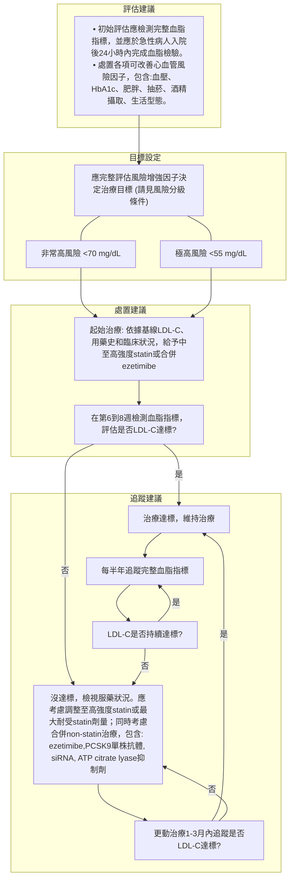

24

2025 台灣血脂管理臨床路徑共識。李貽恒、石崇良。內科學誌。 2024 ： 35 ： 426-430 。
TRO-2026-001

# AHA PREVENT-ASCVD Equations and risk enhancers

## PREVENT™ Equations1

> icon: megaphone Should be used in adults aged 30–79 years without ASCVD or subclinical atherosclerosis and with an LDL-C level of 70–189 mg/dL (COR <mark>1</mark>; LOE <mark>B-NR</mark>)

<table>
  <thead>
    <tr>
        <th colspan="3">Commonly available risk factors</th>
    </tr>
  </thead>
  <tbody>
    <tr>
        <td>Sex (Male, Female)</td>
        <td>Age (30–79 years)</td>
        <td>Systolic BP (90–200 mmHg)</td>
    </tr>
    <tr>
        <td>Total cholesterol (130–320 mg/dL)</td>
        <td>HDL-C (20–100 mg/dL)</td>
        <td>eGFR (15–250 mL/min/1.73m2)</td>
    </tr>
    <tr>
        <td>Body mass index (18.5–39.9 kg/m2)</td>
        <td>Diabetes (Yes, No)</td>
        <td> </td>
    </tr>
    <tr>
        <td>Current smoking (Yes, No)</td>
        <td>Statin use (Yes, No)</td>
        <td> </td>
    </tr>
    <tr>
        <th colspan="3">Optional risk factors</th>
    </tr>
    <tr>
        <td>UACR* (0–25000 mg/g)</td>
        <td>HbA1c† (3–15%)</td>
        <td>Anti-HTN medication (Yes, No)</td>
    </tr>
    <tr>
        <td> </td>
        <td> </td>
        <td>Zip Code‡</td>
    </tr>
  </tbody>
</table>

\*UACR is clinically indicated for individuals with chronic kidney disease, diabetes, or hypertension. †HbA1c is clinically indicated for individuals with diabetes, prediabetes, overweight, or obesity, or those with history of gestational diabetes. ‡Valid 5-digit zip code is needed to estimate social deprivation index (SDI).

### 10-Year ASCVD Risk Estimates2

<table>
    <tr>
        <td>Low</td>
        <td>&#x3C;3%</td>
        <td>Borderline</td>
        <td>3–5%</td>
        <td>Intermediate</td>
        <td>5–10%</td>
        <td>High</td>
        <td>≥10%</td>
    </tr>
</table>

> icon: megaphone In adults without ASCVD with a **borderline** 10-year ASCVD risk estimate (**3% to <5%**) by the PREVENT-ASCVD equations, **consideration of risk enhancers is reasonable** to personalize risk assessment and the potential benefit of initiating LLT as an adjunct to lifestyle management to reduce ASCVD risk2 (COR <mark>2a</mark>; LOE <mark>B-NR</mark>)

## Risk enhancers2

<table>
    <tr>
        <td>Family history of premature ASCVDa</td>
        <td>hsCRP ≥2 mg/L on >1 occasion</td>
    </tr>
    <tr>
        <td>Higher risk ancestryb</td>
        <td>Triglycerides persistently ≥175 mg/dL (nonfasting) and ≥50 mg/dL (fasting)</td>
    </tr>
    <tr>
        <td>High polygenic risk</td>
        <td>Chronic inflammatory diseasesc</td>
    </tr>
    <tr>
        <td>CKM syndrome</td>
        <td>LDL-Cd persistently ≥160–189 mg/dL, non–HDL-C ≥190–219 mg/dL or apoB ≥120 mg/dL</td>
    </tr>
    <tr>
        <td>Lp(a) ≥50 mg/dL</td>
        <td>Reproductive risk markers</td>
    </tr>
</table>

aIn a parent or sibling (onset age <55 y for men, <65 y for women). beg, South Asian, Filipino. ceg, systemic lupus, rheumatoid arthritis, advanced psoriasis, inflammatory arthritis. dAlthough LDL-C is not included in the PREVENT-ASCVD equations (total cholesterol and HDL-C are included), it is included here because persistent elevation of LDL-C may be a useful factor to include in risk-benefit discussions about LDL-C–lowering therapy, given that it is the target of that therapy.

AHA, American Heart Association; apoB, apolipoprotein B; ASCVD, atherosclerotic cardiovascular disease; BP, blood pressure; CKM, cardiovascular-kidney-metabolic; COR, class of recommendation; eGFR, estimated glomerular filtration rate; HbA1c, hemoglobin A1c; HDL-C, high-density lipoprotein cholesterol; hsCRP, high-sensitivity C-reactive protein; HTN, hypertension; LDL-C, low-density lipoprotein cholesterol; LLT, lipid-lowering therapy; LOE, level of evidence; Lp(a), lipoprotein (a); UACR, urinary albumin/creatinine ratio. **References: 1.** The American Heart Association PREVENT™ Online Calculator. Available at: [https://professional.heart.org/en/guidelines-and-statements/prevent-calculator](https://professional.heart.org/en/guidelines-and-statements/prevent-calculator) (Accessed in 2026.03) **2.** Blumenthal RS, et al. J Am Coll Cardiol. Published online March 13, 2026. doi:10.1016/j.jacc.2025.11.016.

25

TON-2026-004

# 2026 ACC/AHA Guideline recommendations on primary prevention

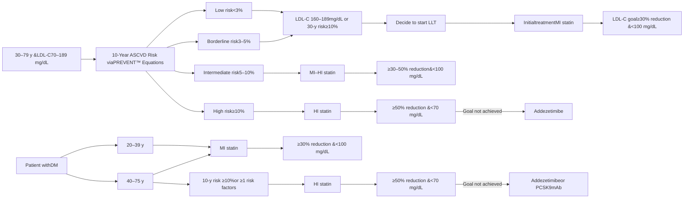

ACC, American College of Cardiology; AHA, American Heart Association; ASCVD, atherosclerotic cardiovascular disease; HI, high-intensity; LDL-C, low-density lipoprotein cholesterol; LLT, lipid-lowering therapy; mAb, monoclonal antibody; MI, moderate-intensity; PCSK9, proprotein convertase subtilisin/kexin type 9; y, years.

Reference: 1. Blumenthal RS, et al. J Am Coll Cardiol. Published online March 13, 2026. doi:10.1016/j.jacc.2025.11.016.

26

TRO-2026-001

# 2026 ACC/AHA Guideline recommendations on secondary prevention

<table>
  <thead>
    <tr>
        <th>Patient Population</th>
        <th>Risk Category</th>
        <th>Initial treatment</th>
        <th>LDL-C goal</th>
        <th>Goal not achieved</th>
        <th>Next Step</th>
    </tr>
  </thead>
  <tbody>
    <tr>
        <td rowspan="2">Adult with clinical ASCVD</td>
        <td>Not very high risk</td>
        <td rowspan="2">High-intensity statin or maximally tolerated statin</td>
        <td>≥50% reduction &#x26; &#x3C;70 mg/dL</td>
        <td>Goal not achieved</td>
        <td>Add ezetimibe ± PCSK9 mAb ± bempedoic acid</td>
    </tr>
    <tr>
        <td>very high risk</td>
        <td>≥50% reduction &#x26; &#x3C;55 mg/dL</td>
        <td>Goal not achieved</td>
        <td>Add ezetimibe ± PCSK9 mAb</td>
    </tr>
  </tbody>
</table>

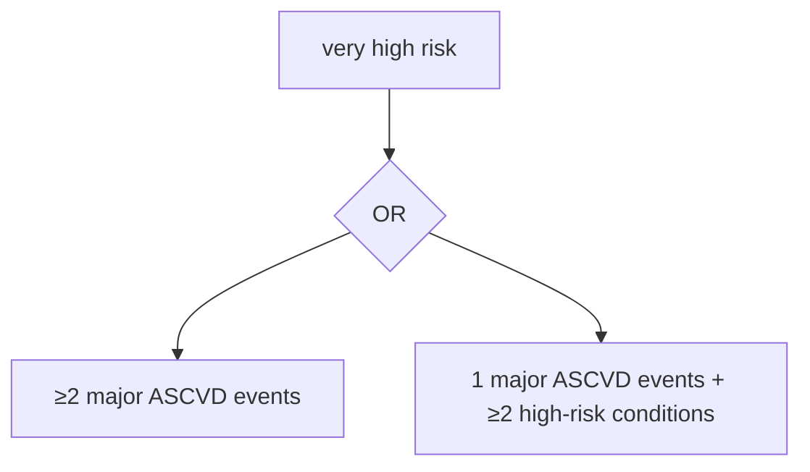

## Major ASCVD events

* [ ] ACS within past 12 months
* [ ] History of MI (other than ACS)
* [ ] History of ischemic stroke
* [ ] Symptomatic PAD

## High-risk conditions

* [ ] Age ≥65 years
* [ ] Coronary bypass or percutaneous intervention
* [ ] Current smoker
* [ ] Diabetes
* [ ] History of CHF
* [ ] Hypertension
* [ ] LDL-C ≥100 mg/dL despite maximally tolerated statin + ezetimibe

ACC, American College of Cardiology; ACS, acute coronary syndrome; AHA, American Heart Association; ASCVD, atherosclerotic cardiovascular disease; CHF, congestive heart failure; LDL-C, low-density lipoprotein cholesterol; mAb, monoclonal antibody; MI, myocardial infarction; PAD, peripheral artery disease; PCSK9, proprotein convertase subtilisin/kexin type 9.

Reference: 1. Blumenthal RS, et al. J Am Coll Cardiol. Published online March 13, 2026. [doi:10.1016/j.jacc.2025.11.016](https://doi.org/10.1016/j.jacc.2025.11.016).

TRO-2026-001
27

# Comparison of 2018 vs. 2026 ACC/AHA Guideline

icon: lightbulb

**Primary logic**

**Treatment objective**

**LDL-C benchmark**

**Risk assessment**

**Escalation strategy**

icon: medication pills

**Role of non-statin**

## 2018 Guideline1

**Intensity-based:**
focus on statin intensity

LDL-C % reduction (≥50%/30%)

Single threshold: ≥70 mg/dL

Pooled Cohort Equation (PCE)

Maximize statin, then consider add-on

Consider add-on if above threshold

## 2026 Guideline2

**Goal-directed:**
focus on LDL-C target

<mark>Clear targets!</mark>

Absolute numerical goals

<mark>Stricter goals</mark>

Risk-stratified goals

PREVENT™ Equations

<mark>Earlier combination</mark>

Timely intensification to reach goal
Mandatory escalation if goal not reached

ACC, American College of Cardiology; AHA, American Heart Association; LDL-C, low-density lipoprotein cholesterol.
References: 1. Grundy SM, et al. Circulation. 2019;139(25):e1082-e1143. 2. Blumenthal RS, et al. J Am Coll Cardiol. Published online [March 13, 2026](https://doi.org/10.1016/j.jacc.2025.11.016). [doi:10.1016/j.jacc.2025.11.016](https://doi.org/10.1016/j.jacc.2025.11.016)

TRO-2026-001
28

# ASCVD 病人建議以中 / 高強度 statin 或 中等強度 statin+ezetimibe 做為首選治療

<table>
  <tr>
    <th>
      2022 focused update of the 2017 Taiwan lipid guidelines for high risk patients
    </th>
  </tr>
  <tr>
    <td>
      Established diagnosis of CAD/ACS, PAD or IS/TIA
    </td>
  </tr>
</table>

**Established diagnosis of CAD/ACS, PAD or IS/TIA** — Moderate- / high-intensity statin or moderated-intensity statin + ezetimibe based on baseline LDL-C level & clinical condition

ACS, acute coronary syndrome; CAD, coronary artery disease; IS, ischemic stroke; LDL-C, low-density lipoprotein cholesterol; PAD, peripheral arterial disease; TIA, transient ischemic attack.
Chen PS, et al. J Formos Med Assoc. 2022;121(8):1363-1370.

TRO-2026-001

29

# LDL-C 控制：越早、越低、越久越好
# 強調針對高風險病人降低 LDL-C 至少 50% 的治療目標

* 2023 年 台灣心臟學會慢性冠心症 (Chronic Coronary Syndrome) 診斷治療指引 1

## 9.1.4 *Upfront combination of statin and non-statin agents* in CCS patients at extremely high risk

Moreover, recent RCTs using non-statin LLTs (ezetimibeand/or PCSK9 inhibitors), a meta-analysis, and Mendelian randomization data, support the concept of <mark>“the earlier the better”</mark>, <mark>“the lower the better”</mark> and <mark>“the longer the better”</mark>. Most guidelines recommend the use of high-intensity statins to <mark>lower LDL-C by at least 50%</mark> in patients with CVD and those at high risk. Current international guidelines still recommend using high-intensity statin monotherapy before considering combination therapy. Based on the rule of “the earlier, the better”, upfront combination therapy should be the new standard of care to achieve the LDL-C target, particularly in patents at the higher risk.

icon: document and pencil

### 2023 TSC 指引、 2021 EAS 指引均強調 1,2 ：

高風險族群<mark>提早接受組合治療 ( 如 statin+ezetimibe)</mark> ，使 LDL-C 達標，更有利於心血管結果

CCS, chronic coronary syndrome; CVD. Cardiovascular disease; EAS, European Atherosclerosis Society; LDL-C, low-density lipoprotein cholesterol; LLTs, lipid-lowering treatments; PCSK9, proprotein convertase subtilisin kexin type 9; RCTs, randomized controlled trials; TSC, Taiwan Society of Cardiology.

1. Ueng KC, et al. Acta Cardiol Sin. 2023;39(1):4-96. 2. Averna M, et al. Atherosclerosis. 2021;325:99-109.

TRO-2026-001

30

# 2025 美國糖尿病協會治療指引
# 調整糖尿病患者心血管風險的血脂目標

## Primary prevention of ASCVD

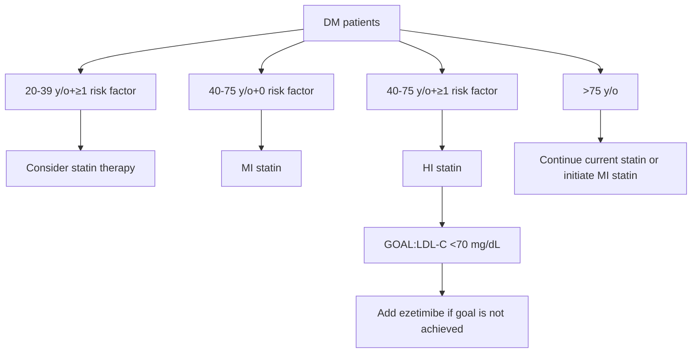

## Secondary prevention of ASCVD

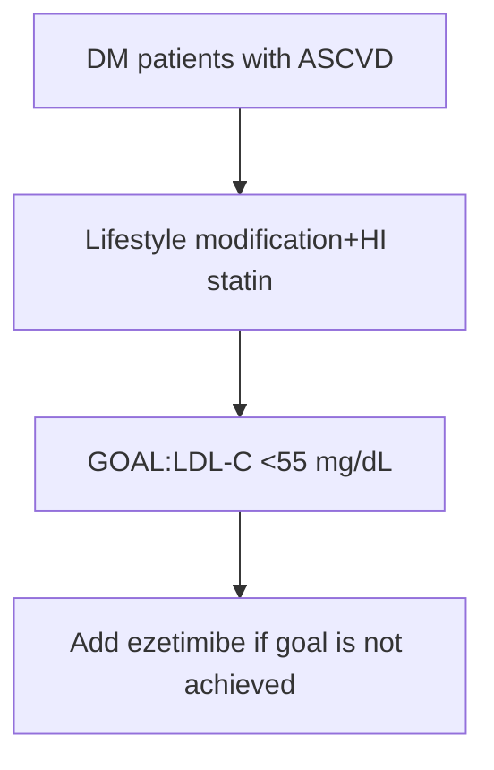

ASCVD, atherosclerotic cardiovascular disease; DM, diabetes mellitus; HI, high-intensity; LDL-C, low-density lipoprotein cholesterol; MI, moderate-intensity.
American Diabetes Association Professional Practice Committee. Diabetes Care. 2025;48(1 Suppl 1):S207-S238.

TRO-2026-001

31

# Phase III Study of Pitavastatin/ezetimibe FDC study

in Taiwan, Australia and New Zealand

FDC, fixed-dose combination.
32

# Pitavastatin+ezetimibe FDC 的第三期臨床試驗

Multicenter, multinational (Taiwan, Australia, New Zealand), randomized, active-controlled, parallel-group, double-blind, phase III clinical trial

icon: person

* 20-80 years old

* Primary hypercholesterolemia / mixed dyslipidemia

* LDL-C 130-250 mg/dL and TG ≤350 mg/dL

**R**
**1:1:1**

Pitavastatin/ezetimibe 2/10 mg FDC (n=122)

Pitavastatin 2 mg (n=126)

Ezetimibe 10 mg (n=124)

## Primary efficacy end point

* Percent change from baseline in LDL-C levels at week 12

## Secondary efficacy endpoint

* Percent changes from baseline in other lipids (TC, HDL-C, TG, non-HDL-C, apo A1, and apo B) at weeks 4, 8, and 12

6-week placebo run-in period

12-week treatment period

2-week follow-up period

Apo, apolipoprotein; FDC, fixed-dose combination; HDL-C, high density lipoprotein cholesterol; LDL-C, low density lipoprotein cholesterol; R, randomization; TC, total cholesterol; TG, triglyceride.
Chou MT, et al. Clin Ther. 2022;S0149-2918(22)00286-7.

TRO-2026-001

33

# 第三期臨床試驗證實，治療 12 週， LDL-C 降幅超過 50% ，顯著優於個別單方治療

## Mean percent change in LDL-C levels from baseline to week 4 and week 12 (ITT population)

<table>
  <thead>
    <tr>
        <th>Week</th>
        <th>Pitavastatin/ezetimibe</th>
        <th>Pitavastatin</th>
        <th>Ezetimibe</th>
    </tr>
  </thead>
  <tbody>
    <tr>
        <td>Week 4</td>
        <td>-51.04</td>
        <td>-34.99*</td>
        <td>-20.01*</td>
    </tr>
    <tr>
        <td>Week 12</td>
        <td>-50.5</td>
        <td>-36.11*</td>
        <td>-19.85*</td>
    </tr>
  </tbody>
</table>

\*p<0.001 versus the pitavastatin/ezetimibe FDC group.

> Compared with the monotherapies, significant LDL-C-lowering efficacy of pitavastatin/ezetimibe FDC with a reduction rate up to 51.04% was observed as early as week 4

FDC, foxed-dose combination; ITT, intention-to-treat; LDL-C, low-density lipoprotein cholesterol.
Chou MT, et al. Clin Ther. 2022;44(10):1272-1281.

TRO-2026-001

34

# Pitavastatin+ezetimibe FDC 組的 LDL-C 達標率明顯優於個別單方組，可協助超過 9 成糖尿病血脂異常病人血脂達標

**Percentage of patients achieving LDL-C target (<100 mg/dL) at week 12 in patients given a class I recommendation for primary ASCVD prevention**

<table>
  <thead>
    <tr>
        <th>Patient Group</th>
        <th>Pitavastatin/ezetimibe</th>
        <th>Pitavastatin</th>
        <th>Ezetimibe</th>
    </tr>
  </thead>
  <tbody>
    <tr>
        <td>LDL-C ≥190 mg/dL</td>
        <td>65.22</td>
        <td>6.67</td>
        <td>0</td>
    </tr>
    <tr>
        <td>DM / age 40-75 y/o</td>
        <td>94.12</td>
        <td>25</td>
        <td>0</td>
    </tr>
  </tbody>
</table>

\*\*p<0.0001 versus the pitavastatin/ezetimibe FDC group.

ASCVD, atherosclerotic cardiovascular disease; DM, diabetes mellitus; FDC, fixed-dose combination; LDL-C, low-density lipoprotein cholesterol; y/o, years old.
Chou MT, et al. Clin Ther. 2022;S0149-2918(22)00286-7.

TRO-2026-001

37

# 各組之間的不良事件發生率和藥物相關不良事件發生率無顯著差異

## Summary of AEs

* AEs and drug-related AEs occurred in 171 (44%) and 28 (7%) patients, respectively, and most of them were mild to moderate .

* Overall, there were no significant differences in the incidence of AEs and drug-related AEs among groups

<table>
  <tr>
    <th>
      Variable
    </th>
    <th>
      Pitavastatin/ezetimibe (n=128)
    </th>
    <th>
      Pitavastatin (n=132)
    </th>
    <th>
      Ezetimibe (n=128)
    </th>
  </tr>
  <tr>
    <td>
      All AEs
    </td>
    <td>
      58 (45.3)
    </td>
    <td>
      52 (39.4)
    </td>
    <td>
      61 (47.7)
    </td>
  </tr>
  <tr>
    <td>
      Incidence ≥2% AEs
    </td>
    <td>
    </td>
    <td>
    </td>
    <td>
    </td>
  </tr>
  <tr>
    <td>
      Back pain
    </td>
    <td>
      7 (5.5)
    </td>
    <td>
      2 (1.5)
    </td>
    <td>
      5 (3.9)
    </td>
  </tr>
  <tr>
    <td>
      Myalgia
    </td>
    <td>
      4 (3.1)
    </td>
    <td>
      6 (4.5)
    </td>
    <td>
      4 (3.1)
    </td>
  </tr>
  <tr>
    <td>
      Upper RTI
    </td>
    <td>
      1 (0.8)
    </td>
    <td>
      5 (3.8)
    </td>
    <td>
      5 (3.9)
    </td>
  </tr>
  <tr>
    <td>
      Headache
    </td>
    <td>
      6 (4.7)
    </td>
    <td>
      1 (0.8)
    </td>
    <td>
      2 (1.6)
    </td>
  </tr>
  <tr>
    <td>
      Diarrhea
    </td>
    <td>
      3 (2.3)
    </td>
    <td>
      1 (0.8)
    </td>
    <td>
      4 (3.1)
    </td>
  </tr>
  <tr>
    <td>
      Increased blood CPK
    </td>
    <td>
      4 (3.1)
    </td>
    <td>
      0
    </td>
    <td>
      3 (2.3)
    </td>
  </tr>
  <tr>
    <td>
      Dizziness
    </td>
    <td>
      3 (2.3)
    </td>
    <td>
      2 (1.5)
    </td>
    <td>
      2 (1.6)
    </td>
  </tr>
  <tr>
    <td>
      Drug-related AEs
    </td>
    <td>
      11 (8.6)
    </td>
    <td>
      8 (6.1)
    </td>
    <td>
      9 (7.0)
    </td>
  </tr>
  <tr>
    <td>
      Incidence ≥2% AEs
    </td>
    <td>
    </td>
    <td>
    </td>
    <td>
    </td>
  </tr>
  <tr>
    <td>
      Increased blood CPK
    </td>
    <td>
      4 (3.1)
    </td>
    <td>
      0
    </td>
    <td>
      3 (2.3)
    </td>
  </tr>
  <tr>
    <td>
      Myalgia
    </td>
    <td>
      3 (2.3)
    </td>
    <td>
      3 (2.3)
    </td>
    <td>
      2 (1.6)
    </td>
  </tr>
</table>

ACR, albumin/creatinine ratio; AE, adverse event; CPK, creatine phosphokinase; RTI, respiratory tract infection.
Chou MT, et al. Clin Ther. 2022;S0149-2918(22)00286-7.

TRO-2026-001

38

# 為什麼 Pitavastatin 是適合三高患者的降脂選擇？

39

TRO-2026-001

# Pitavastatin 主要經 glucuronidation 代謝，
# 不會與 CYP3A4 抑制劑或促進劑發生藥物交互作用

## 降血脂藥物 代謝途徑

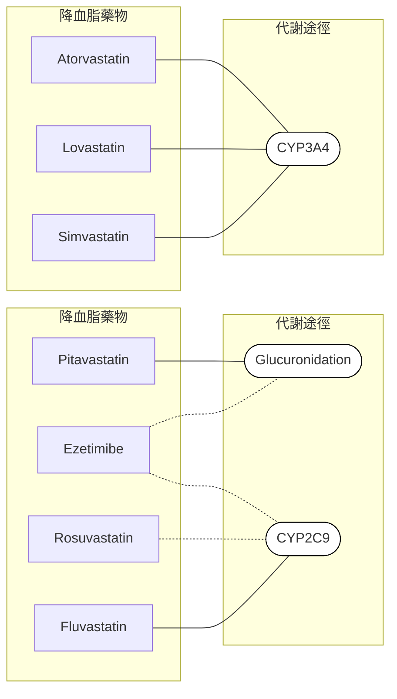

**——** Major metabolism route
**····▶** Minor metabolism route

Pitavastatin is mostly excreted unchanged, with a small portion undergoing glucuronidation

DDIs when co-administrated with

## CYP3A4 or CYP2C9 inducers

* Carbamazepine

* Phenobarbital

* Phenytoin

* Rifampicin

icon: plus sign

Statin blood concentration

icon: arrow down

## CYP3A4 or CYP2C9 inhibitors

* Cyclosporine

* Clarithromycin, erythromycin

* Amiodarone

* Itraconazole, ketoconazole

* Ritonavir

* Diltiazem, verapamil

* Grapefruit juice

icon: minus sign

Statin blood concentration

icon: arrow up

40

CYP, cytochrome P450.
Corsini A, et al. Curr Med Res Opin. 2011;27(8):1551-1562.

# Pitavastatin 之藥物交互作用及不良反應風險較低

icon: gear

Open-label, observational study analyzing incidence of ADRs after 3-month treatment

## Incidence of ADR1

<table>
  <thead>
    <tr>
        <th>Drug</th>
        <th>Incidence rate (%)</th>
        <th>Ratio (n/N)</th>
    </tr>
  </thead>
  <tbody>
    <tr>
        <td>Pitavastatin</td>
        <td>6.1</td>
        <td>1,206/19,921</td>
    </tr>
    <tr>
        <td>Atorvastatin</td>
        <td>12.0</td>
        <td>576/4,805</td>
    </tr>
    <tr>
        <td>Rosuvastatin</td>
        <td>11.1</td>
        <td>978/8,795</td>
    </tr>
  </tbody>
</table>

Lower incidence of ADR was observed with pitavastatin

icon: gear

LIVES 2-year post-marketing evaluated pitavastatin treatment for up to 2 years of follow-up

## Risk of ADRs with co-administration of pitavastatin2

<table>
  <tr>
    <th>
      Concomitant medication
    </th>
    <th>
      Co-administration with pitavastatin
    </th>
    <th>
      Incidence rate (%)
    </th>
    <th>
      p
    </th>
  </tr>
  <tr>
    <td>
      Antiplatelet drugs
    </td>
    <td>
      Yes
    </td>
    <td>
      10.4 (9.9-10.9)
    </td>
    <td>
      0.913
    </td>
  </tr>
  <tr>
    <td>
    </td>
    <td>
      No
    </td>
    <td>
      10.3 (9.4-11.3)
    </td>
    <td>
    </td>
  </tr>
  <tr>
    <td>
      Antidiabetic drugs
    </td>
    <td>
      Yes
    </td>
    <td>
      10.5 (10.0-11.0)
    </td>
    <td>
      0.387
    </td>
  </tr>
  <tr>
    <td>
    </td>
    <td>
      No
    </td>
    <td>
      10.0 (9.1-11.0)
    </td>
    <td>
    </td>
  </tr>
  <tr>
    <td>
      Antihypertensive drugs
    </td>
    <td>
      Yes
    </td>
    <td>
      10.3 (9.7-10.9)
    </td>
    <td>
      0.591
    </td>
  </tr>
  <tr>
    <td>
    </td>
    <td>
      No
    </td>
    <td>
      10.5 (9.9-11.1)
    </td>
    <td>
    </td>
  </tr>
  <tr>
    <td>
      Lipid-lowering drugs
    </td>
    <td>
      Yes
    </td>
    <td>
      10.5 (10.1-11.0)
    </td>
    <td>
      0.013
    </td>
  </tr>
  <tr>
    <td>
    </td>
    <td>
      No
    </td>
    <td>
      8.4 (7.0-10.0)
    </td>
    <td>
    </td>
  </tr>
</table>

ADRs occurred at similar rates regardless of co-administration with commonly used drugs

ADR, adverse drug reaction; LIVES, Livalo® Effectiveness and Safety study.

1. Saito Y. Vasc Health Risk Manag. 2009;5:921-936. 2. Corsini A, et al. Curr Med Res Opin. 2011;27(8):1551-1562.

TRO-2026-001

41

# Recap and Summary

42

# 改善用藥依順性，帶領多重用藥患者走向更好的臨床結果

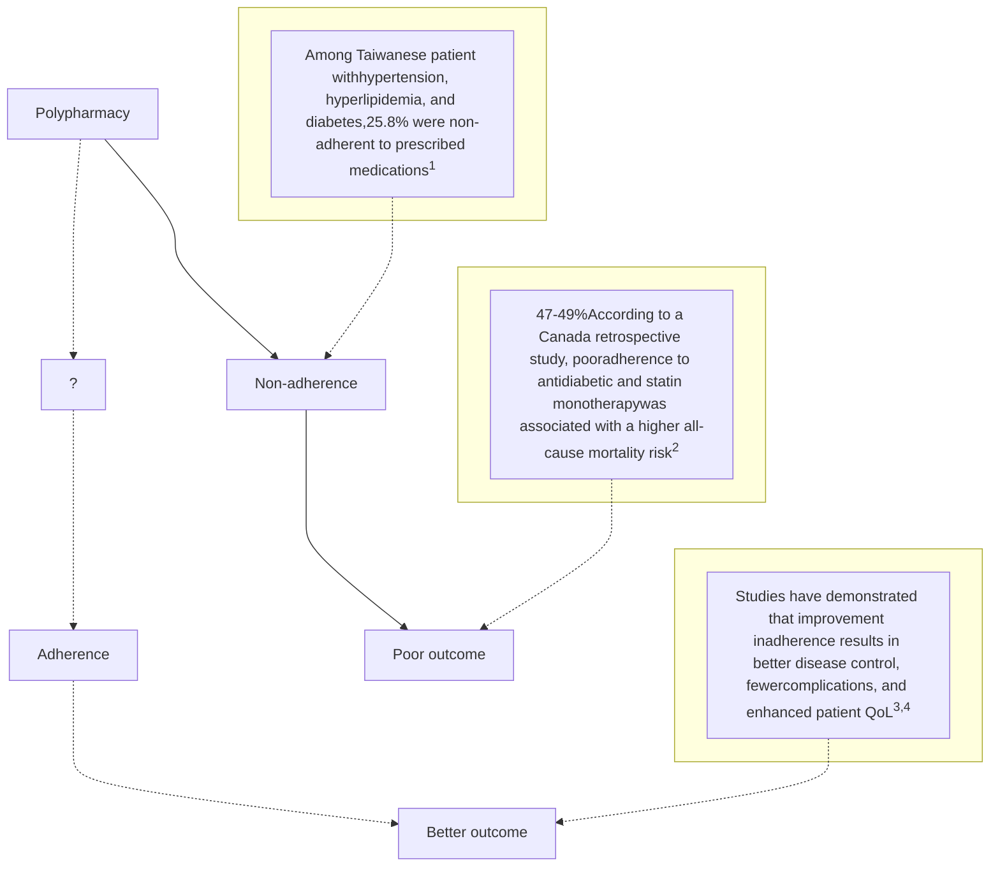

QoL, quality of life.
1. Lin YW, et al. PLoS One. 2024;19(7):e0304442. 2. Su M, et al. PLoS One. 2025;20(4):e0319991. 3. van Driel ML, et al. Cochrane Database Syst Rev. 2016;12(12):CD004371. 4. Religioni U, et al. Medicina (Kaunas). 2025;61(1):153.

TRO-2026-001

43

# 固定劑量複方 (FDC)：簡化帶來依順性，進而影響臨床成效

icon: two separate capsules

icon: simplification arrow
Simplification

icon: single FDC capsule

**Fixed-dose combination (FDC)**

icon: calendar with pill

## Improved Adherence

A meta-analysis of 61 studies suggests that FDC can improve adherence to treatment and its advantages over free-equivalent combination may increase over time1

icon: thumbs up chart

## Enhanced Efficacy

A retrospective study revealed that statin + ezetimibe effectively reduced LDL-C and increased the proportion of patients with controlled LDL-C, with FDC being more effective than separate pill combination2

FDC, fixed-dose combination; LDL-C, low-density lipoprotein cholesterol.
1. Wei Q, et al. Front Pharmacol. 2023;14:1156081. 2. Katzmann JL, et al. Clin Res Cardiol. 2022;111(3):243-252.

TRO-2026-001

44

# 相比同時服用 statin 和 ezetimibe 兩顆藥，statin+ezetimibe 固定劑量複方 (FDC) 能提供較佳的降脂效果

icon: gear A retrospective cohort study using cross-sectional data from IMS® Disease Analyzer (2013.1-2018.12)

icon: pill Statin + ezetimibe FDC (n=6,429) vs Statin + ezetimibe separate pills (n=533)

icon: patient silhouette
Patients with very high CV risk

<table>
  <thead>
    <tr>
        <th>Treatment</th>
        <th><u>LDL-C level</u></th>
        <th><u>Achieving LDL-C &#x3C;70 mg/dL</u></th>
    </tr>
  </thead>
  <tbody>
    <tr>
        <td>Statin + ezetimibe FDC (n=1,639)</td>
        <td>-28.4%</td>
        <td>31.5%</td>
    </tr>
    <tr>
        <td>Statin + Ezetimibe (As separate pills, n=796)</td>
        <td>-19.4%</td>
        <td>21.0%</td>
    </tr>
  </tbody>
</table>

> The findings highlighted the importance of strategies to support medication adherence

CV, cardiovascular; FDC, fixed-dose combination; LDL-C, low-density lipoprotein cholesterol.
Katzmann JL, et al. Clin Res Cardiol. 2022;111(3):243-252.

TRO-2026-001

45

# 降脂工具，您有更好的選擇

46

# Tonvasca® 產品資訊

<table>
  <tr>
    <th>
      中英文品名
    </th>
    <th>
      同抑脂膠囊 2/10毫克 / Tonvasca® Capsule 2/10mg
    </th>
  </tr>
  <tr>
    <td>
      藥品許可證字號
    </td>
    <td>
      衛部藥製字第061165號
    </td>
  </tr>
  <tr>
    <td>
      主成分/劑型
    </td>
    <td>
      Pitavastatin 2 mg / ezetimibe 10 mg / 膠囊
    </td>
  </tr>
  <tr>
    <td>
      衛福部核准適應症
    </td>
    <td>
      原發性高膽固醇血症及混合型血脂異常
    </td>
  </tr>
  <tr>
    <td>
      包裝規格量
    </td>
    <td>
      28 caps / box
    </td>
  </tr>
  <tr>
    <td>
      健保價
    </td>
    <td>
      16.7元/顆
    </td>
  </tr>
  <tr>
    <td>
      產品包裝/膠囊
    </td>
    <td>
    </td>
  </tr>
</table>

**中文品名**

通脂妥膠囊 2/10 毫克 Tonvasca Capsule 2/10mg

**健保代碼**

BC28116100

**成分/劑量**

Pitavastatin 2 mg / ezetimibe 10 mg /

**健保規範**

BA

**包裝**

28 caps / box

**自費價格** 16.7

logo: Tonvasca product packaging details

icon: measurement scale in centimeters

**備註**

TRO-2026-001

# Tonvasca® 產品資訊

<table>
  <tr>
    <th>
      中英文品名
    </th>
    <th>
      同抑脂膠囊 4/10毫克 / Tonvasca® Capsule 4/10mg
    </th>
  </tr>
  <tr>
    <td>
      藥品許可證字號
    </td>
    <td>
      衛部藥製字第062066號
    </td>
  </tr>
  <tr>
    <td>
      主成分/劑型
    </td>
    <td>
      Pitavastatin 4 mg / ezetimibe 10 mg / 膠囊
    </td>
  </tr>
  <tr>
    <td>
      衛福部核准適應症
    </td>
    <td>
      原發性高膽固醇血症及混合型血脂異常
    </td>
  </tr>
  <tr>
    <td>
      包裝規格量
    </td>
    <td>
      28 caps / box
    </td>
  </tr>
  <tr>
    <td>
      健保價
    </td>
    <td>
      申請中
    </td>
  </tr>
  <tr>
    <td>
      產品包裝/膠囊
    </td>
    <td>
    </td>
  </tr>
</table>

**商品名**

**成分/劑量**

**健保代碼**

**包裝**

**外觀**

**仿單**

**同抑脂 膠囊 4/10 毫克**

Tonvasca 4/10 mg

Pitavastatin 4 mg / ezetimibe 10 mg / cap

B027844100

28 caps / box

如圖示

qr_code: 電子仿單請掃此二維條碼

photograph: 產品外觀與比例尺

TRO-2026-001

# Tonvasca® – 產品特色

1. 具多國多中心臨床試驗。證實 Tonvasca® 使用 12 週後顯著降低 LDL-C 50.5%，且安全性與各單方相當。

2. 相對安全之 Pitavastatin+ Ezetimibe 複方用藥。

3. MUPS 多單位圓粒系統：特殊微粒劑型，產品穩定專利，台灣研發製造。

TRO-2026-001

49

* **特殊微粒劑型**：方便管灌吞嚥困難者使用

* **產品穩定專利**：具台灣與美國專利證書

* **台灣研發製造**：提升藥品供應鏈韌性

50

# Tonvasca® MUPS (Multiple-unit pellets system) 多單位圓粒系統
## 特殊微粒劑型，提升藥物穩定性，方便鼻胃管灌病人使用

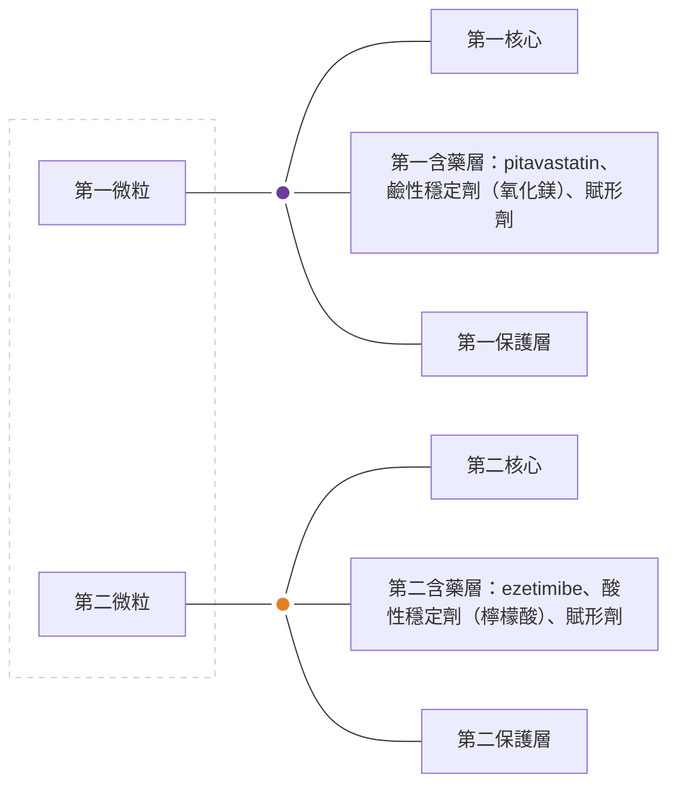

icon: nasogastric tube feeding
**適用於鼻胃管灌2**

* Tonvasca® 膠囊微粒可直接倒出用於管灌

* 膠囊打開即可使用，縮短管灌操作時間

* 微粒不殘留於鼻胃管線中，回收率 100%

icon: thumbs up
**專利微粒劑型優勢1**

* 對個別主成分使用適當的酸鹼穩定劑，提升產品安定性

* 微粒技術使藥物均勻分布於胃腸道中

* 良好球型、表面積大、尺寸分布集中且不易碎，確保藥物含量與吸收的一致性

TRO-2026-001
1. Data on file. 2. Tonvasca® 鼻胃管試驗報告

# Tonvasca® MUPS 台灣與美國專利證書

icon: Republic of China flag

# 中華民國專利證書

發明第 I760067 號

發明名稱：固態口服醫藥組成物

專利權人：友霖生技醫藥股份有限公司

發明人：陳建宇、黃大偉、斯梅克

專利權期間：自2022年4月1日至2041年1月17日止

上開發明業經專利權人依專利法之規定取得專利權

經濟部智慧財產局 局長

signature: 洪淑敏

中華民國 111 年 4 月 1 日

注意：專利權人未依法繳納年費者，其專利權自原繳費期限屆滿後消滅。

bar_code: US011833133B2

## (12) United States Patent
Chen et al.

(10) Patent No.: **US 11,833,133 B2**
(45) Date of Patent: **Dec. 5, 2023**

### (54) SOLID ORAL PHARMACEUTICAL COMPOSITION

(71) Applicant: Orient Pharma Co., Ltd., Taipei (TW)

(72) Inventors: **Chien-Yu Chen**, Taoyuan (TW); **David Wong**, Taoyuan (TW); **Mongkol Sriwongjanya**, Taoyuan (TW)

(73) Assignee: **ORIENT PHARMA CO., LTD.**, Taipei (TW)

(\*) Notice: Subject to any disclaimer, the term of this patent is extended or adjusted under 35 U.S.C. 154(b) by 0 days.

(21) Appl. No.: **17/394,444**

(22) Filed: **Aug. 5, 2021**

**Prior Publication Data**

(65) US 2022/0047547 A1 Feb. 17, 2022

**Related U.S. Application Data**

(60) Provisional application No. 63/064,954, filed on Aug. 13, 2020.

(30) **Foreign Application Priority Data**

Jan. 18, 2021 (TW) 110101784

(51) **Int. Cl.**

A61K 31/397 (2006.01)
A61K 31/47 (2006.01)
A61K 9/00 (2006.01)
A61K 47/02 (2006.01)
A61K 9/48 (2006.01)
A61K 47/12 (2006.01)
A61K 47/32 (2006.01)

(52) **U.S. Cl.**

CPC      **A61K 31/397** (2013.01); **A61K 9/0053** (2013.01); **A61K 9/485** (2013.01); **A61K 9/4808** (2013.01); **A61K 9/4858** (2013.01); **A61K 9/4866** (2013.01); **A61K 31/47** (2013.01); **A61K 47/02** (2013.01); **A61K 47/12** (2013.01); **A61K 47/32** (2013.01)

qr_code: patent information

(58) **Field of Classification Search**

CPC .. A61K 31/397; A61K 9/0053; A61K 9/4808; A61K 9/485; A61K 9/4858; A61K 9/4866; A61K 31/47; A61K 47/02; A61K 47/12; A61K 47/32
See application file for complete search history.

(56) **References Cited**

**U.S. PATENT DOCUMENTS**

<table>
    <tr>
        <td>2004/0126423 A1\*</td>
        <td>7/2004</td>
        <td>Moore</td>
        <td>A61K 31/35 514/460</td>
    </tr>
    <tr>
        <td>2007/0032467 A1\*</td>
        <td>2/2007</td>
        <td>Aoki</td>
        <td>A61P 43/00 514/460</td>
    </tr>
    <tr>
        <td>2007/0160666 A1\*</td>
        <td>7/2007</td>
        <td>Moore</td>
        <td>A61K 9/2018 424/464</td>
    </tr>
    <tr>
        <td>2013/0310420 A1\*</td>
        <td>11/2013</td>
        <td>Hsiao</td>
        <td>A61K 33/08 514/311</td>
    </tr>
</table>

**FOREIGN PATENT DOCUMENTS**

<table>
    <tr>
        <td>CN</td>
        <td>103340852 A</td>
        <td>10/2013</td>
        <td></td>
    </tr>
    <tr>
        <td>TW</td>
        <td>200714280 A</td>
        <td>4/2007</td>
        <td></td>
    </tr>
    <tr>
        <td>WO</td>
        <td>WO-2014027334 A2\*</td>
        <td>2/2014</td>
        <td>A61K 31/549</td>
    </tr>
</table>

**OTHER PUBLICATIONS**

Min Yu, Chunshui Liang, Qianran Kong, Yihan Wang and Minnin Li, Efficacy of combination therapy with ezetimibe and statins versus a double dose of statin monotherapy in participants with hypercholesterolemia: a meta-analysis of literature, Yu et al. Lipids in Health and Disease (2020) 19:1.

\* cited by examiner

Primary Examiner — Robert A Wax
Assistant Examiner — Olga V. Tcherkasskaya
(74) Attorney, Agent, or Firm — **BACON & THOMAS, PLLC**

(57) **ABSTRACT**

A solid oral pharmaceutical composition is disclosed, which comprises: a first active ingredient, which is pitavastatin or a pharmaceutically acceptable salt thereof; a second active ingredient, which is ezetimibe or a pharmaceutically acceptable salt thereof; and at least one excipient, including a diluent, a stabilizing agent, a disintegrant, a binding agent, a sweetener, a lubricant, a glidant, a flavor, a coloring agent or a combination thereof.

**16 Claims, 1 Drawing Sheet**

【57】申請專利範圍

1. 一種固態口服醫藥組成物，包括：一第一活性成分，為匹伐他汀(pitavastatin)或其醫藥上可接受的鹽類；一第二活性成分，為依澤替米貝(ezetimibe)或其醫藥上可接受的鹽類；一鹼性穩定劑，為氧化鎂(magnesium oxide)、矽酸鋁鎂(magnesium aluminometasilicate)、氫氧化鉀(potassium hydroxide)、碳酸氫鈉(sodium bicarbonate)、碳酸鈉(sodium carbonate)、氫氧化鈉(sodium hydroxide)、碳酸鈣(calcium carbonate)、氫氧化銨(ammonium hydroxide)、乙二醇胺(diethanolamine)、或其組合；一酸性穩定劑，為檸檬酸(citric acid)、醋酸(acetic acid)、酒石酸(tartaric acid)、乳酸(lactic acid)、磷酸二氫鈉(sodium phosphate monobasic)、或其組合；以及至少一賦形劑，包括稀釋劑、穩定劑、崩解劑、黏著劑、甜味劑、潤滑劑、助流劑、香料、著色劑、或其組合。

中華民國專利證書號數： I760067 / 專利公報
美國專利：US 11,833,133

醫藥組成物專利：凡以以下成分組成搭配之配方均可能構成侵權的條件，可提出侵權請願或訴訟

TRO-2026-001

# 總結

“台灣高齡者的三高盛行率高，已成常態 ( 高血壓 63% 、高血糖 28% 、高血脂 40%)1

台灣高齡者中，**超過三分之一有多重用藥** (≥5 種 ) 的情況 2

**多重用藥帶來多重問題 3,4 ：**

1. 藥物交互作用風險高

2. 用藥依從性不佳

3. 藥物不良反應風險增加

接受高劑量 statin 治療但仍未達到適當 **LDL-C 水準的患者，仍處於高度心血管風險之中 5**

多項臨床治療指引建議，若患者使用 statin **仍無法達成 LDL-C 治療目標，或對 statin 無法耐受，應加用 ezetimibe 6-9**

# Pitavastatin 2mg/ Ezetimibe 10mg
## 強效、安全、簡化

icon: LDL reduction

臨床試驗證實治療 12 週， LDL-C 降幅 **>50% 10**

icon: safety shield

均不經 CYP3A4 代謝， **DDI 風險低 11**

icon: clinical analysis

綜合分析證實，中強度 statin+ ezetimibe ，**效益超越高強度 statin13**

icon: pill capsule

比起分開服用， **FDC** 改善提升依從性，**降脂效果顯著提升 13**

CYP, cytochrome P450; DDI, drug-drug interaction; FDC, fixed-dose combination; HI, high-intensity; LDL-C low-density lipoprotein cholesterol; MI, moderate-intensity.
1. 111 年健康促進統計年報 2. Meng LC, et al. Arch Gerontol Geriatr. 2023;115:105100. 3. Davies LE, et al. J Am Med Dir Assoc. 2020;21(2):181-187. 4. Borodo SB, et al. Bull Natl Res Cent. 2022;46:178. 5. Masana L, et al. Curr Cardiol Rep. 2020;22(8):66. 6. Mach F, et al. Eur Heart J. 2020;41(1):111-188; 7. Huang PH, et al. J Formos Med Assoc. 2022;S0929-6646(22)00215-7. 8. Chen PS, et al. J Formos Med Assoc. 2022;121(8):1363-1370. 9. American Diabetes Association Professional Practice Committee. Diabetes Care. 2025;48(1 Suppl 1):S207-S238. 10. Chou MT, et al. Clin Ther. 2022;44(10):1272-1281. 11. Corsini A, et al. Curr Med Res Opin. 2011;27(8):1551-1562. 12. Sydhom P, et al. BMC Cardiovasc Disord. 2024;24(1):660. 13. Katzmann JL, et al. Clin Res Cardiol. 2022;111(3):243-252.

TRO-2026-001

53

# The goal is not only to lower LDL-C, but to help patients achieve and maintain their targets over time.

54